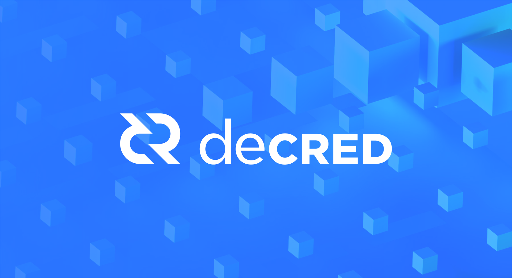

# 比特币与Decred 、以太坊的恩怨

*作者: Insette（Counterparty，Decred 投资者），写于2018年* 

很少人详细了解比特币的权力斗争，导致了Decred现阶段被低估。

自2012年以来，我无助地见证着比特币开发团队的独裁导致比特币错失众多机会。多年来我已经习惯各个数字货币社区无视这一切，从中获益。

比特币开发团队故意限制了比特币区块容量，称小区块是“数字黄金”的基本特质，最大原因是**比特币的小区块对Blockstream的投资者和以太坊背后知名风险投资者都是有利可图的。** 

### 比特币独大, 抵制C0团队

比特币现在是由中心化矿工、中心化开发团体主导，而无数法律上有问题的1CO受到追捧。我环顾四周，发现所有人都被利益冲昏头脑。但我清楚这一切将会被Decred颠覆，而理解Decred需要完整地理解比特币。

2013年，C0 (Decred开发团队) 推出btcsuite，**为比特币全节点领域提供了急需的另一选择。** 在btcsuite公开亮相时，比特币只有一种全节点，现在著名的比特币核心（Bitcoin Core）。比特币核心当时被称为比特币，省略了核心，原因是当时没有其他全节点竞争。为简洁起见，我将从现在开始将比特币核心 称为“BC”。早在2013年，BC就是数字货币世界的中心，而BC的开发团队则是数字货币领域的国王。当时的主流观点是：比特币由最优秀的开发人员开发，他们只有最好的意图。

大众认为BTC可以做任何事情，比特币是无敌的。
 
如此强烈的观点下，在那段时间推出山寨币是一种异端行为， 山寨币推广者经常成为公众羞辱的目标。在比特币成为数字货币之王的短暂阶段，C0决定推出btcsuite。主流互联网协议都有多个版本，何况是比特币？C0试图通过btcsuite解决这个明显不足。

虽然btcsuite获得各个软件社区的赞誉，但BC猛烈抨击btcsuite，声称btcsuite与他们的 C++代码库“脱离共识”，并建议矿工和行业人士拒绝使用btcsuite。

如果你了解2013年BDB比特币分叉，你会发现BC开发人员在这时候提出“脱离共识”是多么的荒谬。简而言之，由于当时网络上运行了软件的不同版本，BC自己的代码库与其自身没法达成共识。 BDB 分叉是比特币的重大事件，它短暂地导致价格腰斩。由此可见，BC开发人员批评C0的代码库“脱离共识”是多么的可笑。

### 智能合约

大约在同一时间，比特币领域另一个非常有争议的议案在暗地里形成。我说“暗地”，因为当时没什么媒体报道，这个议案就是“智能合约”。
没有人知道比特币是否适合运行智能合约，但人们普遍认为基于区块链的智能合约拥有巨大前景。当时猜测会有以下创新：

* 区块链股票发行
* 区块链期权和期货交易
* 区块链预测市场
* 区块链赌博
* 区块链房地产

这都是几十亿美金的市场。很多开发人员相信这就是未来，包括BC开发团队。

### 抵制Counterparty

这时候是2014年1月，Counterparty推出了我认为是第一个在比特币上实现智能合约的共识系统。当时BC公开批评Counterparty，但有趣的是，公开指责Counterparty的BC开发团队在大众并不知情的情况下创建了Blockstream公司，并持有股份，推出了智能合约侧链的秘密计划。

Counterparty没有资本支持，而Blockstream背后的风险资本达到7600万美元。而Counterparty从来没有做过1CO，从来没有从任何人筹集资金，甚至没有预先挖矿。 Counterparty完全没有资金，它是由匿名联合创始人发起的，与中本聪推出比特币时的理念完全一样。

更重要的是，Counterparty系统需要在链上运行，而Blockstream开发的侧链在链下运行。因此，BC一直以来限制比特币区块容量的举动直接导致Counterparty系统不如自家开发的链下侧链。为了实现Blockstream对比特币未来的愿景，他们选择摧毁Counterparty。 我看到Blockstream通过公众舆论将Counterparty诋毁，他们说Counterparty没有价值，Counterparty是寄生虫。**因为利益冲突，Blockstream导致比特币错失运行智能合约的最好机会。** 

### 以太坊诞生

在这段时间，一个不为人知的程序员Vitalik Buterin决定以独立的区块链推出以太坊，而不是在比特币之上推出。Vitalik看到比特币核心开发者对待Counterparty的态度，决定放弃比特币。Vitalik建立以太坊具有重大的历史意义，ETH曾达到比特币90％的市值，而比特币占整体数字货币市场的份额也降到50％，保持至今，这是比特币永久的伤疤。

在我看来，Counterparty和Blockstream之间的冲突和整个1CO热潮，都可以追溯到一个核心问题：治理。这个问题很少人知道或理解，我怀疑市场对这些事情漠不关心是因为这些历史给BC开发团队带来了极其不便的影响。它以戏剧性的方式展示了如果BC开发团队不独裁，以太坊的崛起是完全可以避免的。BC开发团队为了他们公司Blockstream的利益，让公众相信主网区块链不需要扩展，而应该利用侧链在比特币之上实现智能合约。这些都是受益者的借口，投资者清楚知道，如果比特币在其区块链上提供智能合约功能，他们的投资将会付诸东流 。

**比特币现状给Blockstream公司和以太坊投资者带来了经济利益，其中许多人（以及许多其他山寨币）都满足于比特币“无法扩展”的状态。** 这是比特币的真实历史，也是为什么Decred作为比特币的关键替代者存在的原因。

在理解以太坊不需要单独存在之后，你可能会询问如果BC开发团队对以太坊持开放态度，欢迎以太坊建立在比特币之上。那会发生什么？
* 筹集数百万美元的1CO实际上都可以建立在比特币之上。利用比特币筹集资金
* 在比特币之上构建生态，比特币会越来越受欢迎
* 比特币矿工会从总交易费用的增加获利
* 整个数字货币生态会更强大

### Decred诞生

在2016，同样体会Blockstream独裁的C0 团队创立了Decred，设计了PoW / PoS混合共识系统，用于解决比特币面临的问题。想想Blockstream的崛起以及ETH曾经达到BTC 90％的市值， Blockstream的存在很大程度是因为在没有适当资金的支持下，开源开发是不可持续的。

为此，Decred设立10％区块奖励来解决项目资金问题，并将这些资金的使用权提交给DCR持有者投票。 Decred 治理系统的其中一环是锁定DCR，以换取“票据”。票据是不可转让的区块链资产，产生投票权以及被动收入来激励持币者参与治理。

Decred通过建立治理系统，得以避免像Blockstream那样从传统金融机构筹集7600万美元，并将机构利益与比特币开发捆绑。**Decred的价值在于治理，** 治理能解决所有问题，而Decred实施治理系统的方式并没有偏离比特币技术上做得最好的地方。 Blockstream对比特币有过多的控制，而Decred拥有最合理的代币经济与激励措施，我猜测投资DCR将优于投资比特币。

我深信区块链项目应为去中心化，由投资者共同治理，而不是由存在严重利益冲突的公司控制，我打算在遥远的将来继续参与Decred。

翻译: DCR中文社区 Hugo  
Decred微信：DecredProject  
[Decred中文社区](https://blog.dcrclub.org)  
[原文](https://www.reddit.com/r/decred/comments/6wxueo/your_best_pitch_for_decred/)