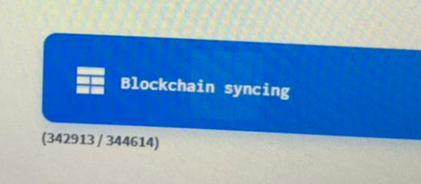

# Decred 重要通知

##Decrediton v1.4.0钱包同步异常卡在342913区块问题
***注意：[DCP0004](https://github.com/decred/dcps/blob/master/dcp-0004/dcp-0004.mediawiki)共识已激活，请不要运行版本低于Decrediton v1.4.0的钱包，否则你将运行在Decred的分叉链上！**

由于[DCP0004](https://github.com/decred/dcps/blob/master/dcp-0004/dcp-0004.mediawiki)共识激活，如果你在区块高度为342913之后没有及时升级Decrediton v1.4.0，升级后会出现区块同步卡在342913高度，如下图：

解决方法如下：
1. 关闭Decrediton钱包，删除旧的区块数据.

    Windows用户默认路径: `C:\Users\<user>\AppData\Local\Dcrd\data\mainnet`
（如果看不到AppData目录请打开Windows的显示隐藏文件和文件夹功能）

    Mac用户默认路径：`/Users/<user>/Library/Application Support/Dcrd/data/mainnet`

    删除此路径下的**blocks_ffldb**目录

2. 打开Decrediton钱包重新同步区块数据即可。

作者: Dante
数据来源：[reddit](https://www.reddit.com/r/decred/comments/bnep6p/if_you_were_running_decrediton_at_13_or_earlier/)