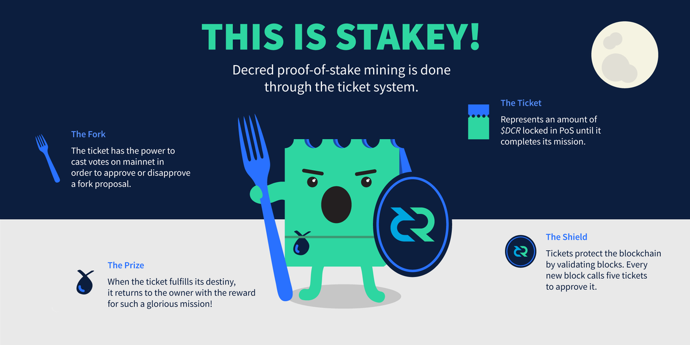

# Decred PoW + PoS 混合共识机制

Decred 是一个工作量证明（PoW）和权益证明（PoS）混合共识机制的加密货币，与纯粹的 PoW 或 PoS 区块链相比具有许多优势。这些优势大部分来自 Decred 独特的权益证明 PoS（Proof of Stake) 系统。票代表参与 Decred PoS 系统的一个标记，如果你持有一票，就代表你是 Decred 利益相关方之一。

利益相关者的主要角色是通过在链上共识投票系统和 Decred 链下提案系统Politeia 来管理 Decred。 Decred 的利益相关者（Stakeholder) 在网络升级，开发和营销方式方面有真实的发言权 – 规则都是由利益相关者制定的。然而，利益相关者也有协助于保护网络， 免受争议性的硬分叉。此外，他们因为这样做而可以获得奖励！

在DCR这条链上，出块的是PoW矿工，但是验证的工作由PoS负责，验证的方法是随机选5张票。这5张票的权利就是投票确认这个区块是不是合格的，同时得到一定DCR奖励。任何用户只要买票了都可以参与验证，买票的方式是通过票池，或者自己solo投票。但是solo投票成功率几乎为零，因为需要24x7维持高可用服务器 以及低延迟网络。一般用户做不到。

* [挖矿POW](POW_with_pool.md)
* [投票POS](how_to_proof_of_stake.md)
* [投票分票](Voting-DecredSplitTicket.md)
* [Decred Staking创新，为什么比其他PoS项目好](dcr_pos_advantage.md)
* [图解选票的生命周期](vote_life_cycle.md)
* [参与Decred PoS的五大理由](why_join_pos.md)
