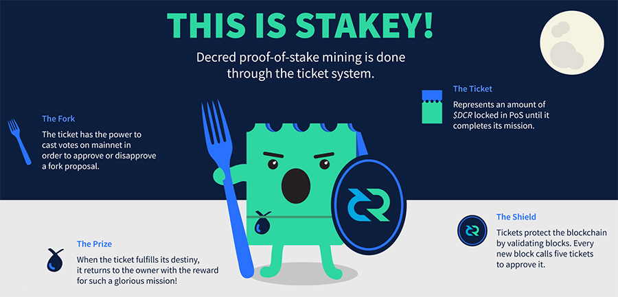
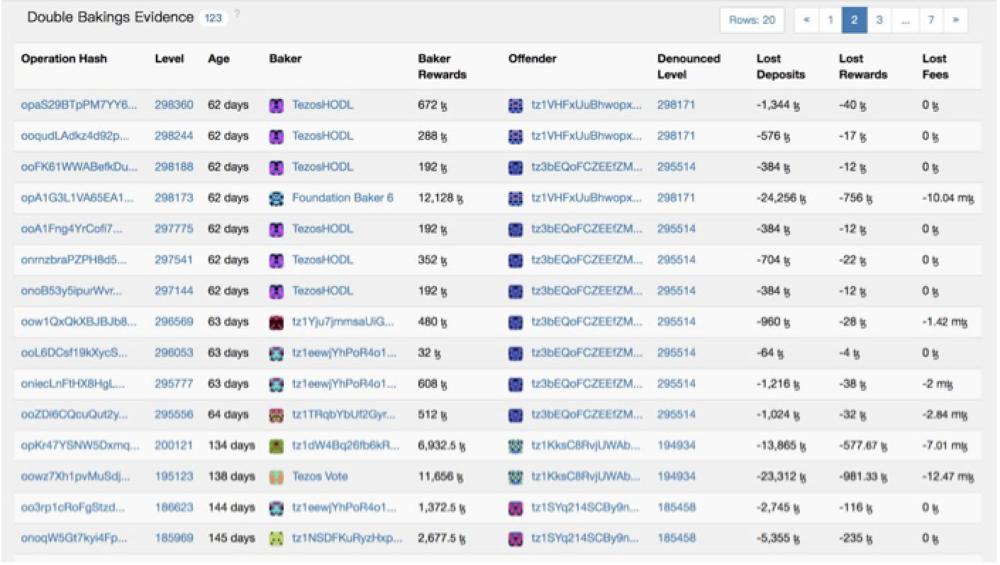

# Decred Staking 创新(上): DCR PoW+PoS混合共识

Decred的发起团队是开发比特币GO语言版本的Btcsuite / btcd 团队。Decred虽然上线主网已经有3年多了，但普通人对DCR了解的比较少。Decred Staking系列分上下两篇，第一篇介绍Decred PoW/PoS混合机制以及Staking 教程，第二篇探讨Decred staking相对其他PoS项目的优势。 

### Decred的起源

* 2013年，Decred的发起团队 *(原Conformal Systems LLC，现名 Company 0 )*  以 Go实作了一个Bitcoin Core版本： btcsuite。尽管这具有高度的技术价值，比特币核心开发小组非但没有对此举与此释出善意，甚至将其拒之门外。同时，在Bitcointalk论坛上，一位用户名为tacotime的匿名用户，开始了一个名为 memcoin2的项目开发。这是最早提出混合共识机制的加密货币项目之一，**旨在创建一个「透过参与式投票，让货币资源的掌控以民主的形式交至用户手中」的货币系统。** 2014年初，tacotime和_ingsoc(另一名Bitcointalk论坛的用户)向Jake (Conformal Systems创始人)联络，讨论memcoin2项目以及关于“decentralizedcredits”的想法。tacotime在提出了这样一个作为启发Decred日后发展的种子后，随后于2014年4月与一些人创建了Monero项目。而Conformal Systems在接受了这样的启发后，便将开发重心从btcsuite转移至一个新的项目-Decred。
* 开发团队花费了约41.5万美元，并经过大约2年时间的开发，Decred于2016年2月份正式上线主网。更详细的DCR创立历史可以到[这里](../chapter_00/btc_dcr_history.md)了解。

Decred是工作证明(proof-of-work)+权益证明(proof-of-stake)的混合共识机制，主要基于Adam Mackenzie (门罗币前开发人员）编写的MC2白皮书, 其中部分参考Iddo Bentov、Charlie Lee（莱特币创始人）、Alex Mizrahi 和 Meni Rosenfeld共同撰写的活动证明Proof of Activity白皮书。

**Decred的PoW+PoS混合共识机制，实质是对纯PoW的改进和扩展，改进纯PoW存在的很多固有问题，扩展纯PoW上没办法实现的一些功能。** Decred独特的混合共识机制提高了攻击Decred的成本，也实现了其他项目不具备的去中心化治理。

### Decred的PoW+PoS混合机制比纯PoS/纯PoW有更多作用：
 
1. 	**链上验证，验证PoW矿工挖出的块，以保证PoW矿工挖出的块符合Decred网络的共识规则**
    
    使用纯PoW，是PoW矿工打包区块并进行验证。而Decred把PoW的工作进行分解，让PoW矿工打包区块，PoS选民验证PoW矿工打包的块，划分了PoW矿工的一部分工作。PoS对PoW矿工日常出块的确认，可以制衡PoW矿工作恶，比如：可以防止PoW矿工51%算力攻击，防止PoW矿工强制硬分叉，阻止PoW矿工打包空块等等。使Decred成为同等条件下攻击成本最高的币，攻击DCR，除了需要大多数算力，还需要需要大多数的PoS选票。

2.  **链上共识投票，决定Decred区块链共识规则的变更**

    Decred链上共识投票分为两个阶段：第一个阶段是要满足区块链变更升级的前置条件，第二个阶段是链上共识投票阶段。第一个阶段中，开发者要发布共识变更升级的分叉代码，95%的PoW算力节点要升级，75%的PoS选民节点要升级。如果这三者中的任何一方不合作、不配合，链上共识投票就根本没办法进行，因为达不到区块链变更升级的前置条件。第二个阶段，在链上共识投票过程中，需要75%的PoS选票同意，链上共识规则投票才算通过。Decred的链上共识规则投票，把普通PoW区块链升级模糊不清的权责明确下来，**可以最大程度让Decred的各方参与，形成更加广泛、更加强大的共识。** 

3.  **链下投票，决定Decred的发展方向，决定Decred的政策**

    这个投票是通过脱链但锚定Decred区块链的Politeia提案系统来进行的，将Decred今后发展方向的制定和决策权，下放给整个社区。

4.  **链下投票，决定如何花费Decred社区基金**

	  Politeia除了决定Decred的发展方向，也是一个讨论和投票如何使用社区基金的平台，把Decred社区基金的资金使用权，下放给整个社区。

### Decred PoS参与者获得30%区块奖励
 
为了参与PoS投票，利益相关者锁定一些DCR以换取选票。锁定DCR的数量被称为票价（票价也可以称为Stake难度），每144个块（约12小时）动态调整。当票价动态调整时，Stake难度算法计算新的票价以试图使全网票数维持在40960票左右。当前的票价可以在Decrediton钱包或[区块浏览器](https://explorer.dcrdata.org/)上找到。
 
Decred每个区块产生时，随机从全网票池中选出5张选票进行链上出块投票，其中至少3张选票同意，这个区块才有效，才能添加到区块链上。如果区块选择少于5张票，则每少1张选票，PoW矿工区块奖励减少20%；如果少于3张选票，则判定PoW矿工打包的区块无效。在这个过程中，调用PoS选票进行投票后，锁定该票的DCR将被解锁并返回给购买者的钱包，如果选票成功投票，则会发放PoS奖励。这个出块过程中的成功投票，我们一般称为中票 *（注意：只有在这个出块过程中的投票，才会有PoS奖励。在链上共识投票或者Politeia提案投票时，是没有PoS奖励的，这些投票是赋予PoS选民的权力）* 
 
**为了补偿选票持有人验证区块和保护Decred网络，30％的区块奖励（PoS奖励）被发送给持票人进行区块投票** （每个区块由5选票确认，每张选票获得6%的区块奖励；如果选票被选中参与区块确认，但错过投票，则这张选票原本应该获得的6%区块奖励被直接放弃，任何人都获得不了，换句话说Decred的总量会相应地减少这部分）;  剩余的区块奖励发放给PoW矿工（60％）和社区基金（10％）（社区基金用来资助项目的开发、市场运营等）。
 
Decred把锁定一些DCR来PoS，称为购票。以2019年5月1号的票价和区块奖励计算，Decred staking 能获得年化11%收入。
 
**Decred PoS选票的具体生命周期如下：** 

1. 您使用[Decrediton GUI钱包](https://decred.org/zh/downloads/)或dcrwallet[命令行钱包](https://docs.decred.org/wallets/cli/dcrwallet-tickets/)购买选票。购买每张选票的总费用应为：票价（Ticket Price） + 选票手续费（Ticket Fee，这个费用实际是POW矿工打包选票的矿工手续费）。
2. 你的选票进入了`内存池`，这时您的选票等待被PoW矿工打包。每个区块，最多只有20张新选票被打包。
3. 选票被打包进一个区块中，高的选票手续费更可能被先打包。
4. 您的选票被打包进一个区块，它就变成了一张不成熟票。这个状态要持续256个块（约21.3小时），这个过程称为选票成熟期。在此期间，选票无法参与投票。被打包后，选票手续费是不可退回的。
5. 您的选票成熟（256个区块）后，它将进入全网票池并拥有投票资格。这时的选票，称为成熟票。
6. A - 选票被选中投出的机会符合泊松概率分布，平均为28天。 
   B – 设定的全网票数为40960张，任何成熟票在40960个区块（约142.2天，约4.7个月）内有99.5％的机会投出去。如果在此时间之后，选票尚未投出，则该选票将过期，选票过期的概率是0.5%。选票过期后，您将收到购票时原票价的退款。 
   C - 如果选票被选中投票时：1）您的钱包或委托代投的VSP没有响应；2）两个区块生成时间太靠近导致选票可能会来不及响应投票。如果发生这两种情况，会发生选票错过，您将收到购票时原票价的退款。
7. 在选票投中，错过或过期后，需要经过256个区块，资金（原票价，或原票价+区块奖励，或原票价 + 区块奖励 - VSP手续费；如果是用委托代投VSP的，还要减去VSP相应的手续费，VSP的手续费小于中票奖励的5%，目前VSP手续费为0.5%-5%）才能被释放。如果选票发生错过或过期时，则钱包会提交选票撤销事务来释放被锁定的选票。注意：只能为错过的选票提交撤销，您无法撤销正常的成熟票。
 
想更多了解选票周期，可以参考[图解](../chapter_02/vote_life_cycle.md)。 

---

## Decred Staking创新(下) : 为什么会在众多PoS项目中选择DCR？

介绍过[Decred的PoS机制](dcr_pos_advantage.md)后，我们进一步探讨Decred Staking相对其他PoS项目的优势。

### 门槛、成本比普遍PoS项目低

一般的主节点币需要用户购买VPS建节点，除了花钱之外，还需要懂些IT技术。**现在大多数PoS币，因为要保证出块的速度，因此对运行PoS出块节点的硬件有一定的技术要求，费用不菲。** 而Decred的PoS Staking, 只要你有一台普通电脑，就可以用CLI命令行钱包直接购票来PoS（保证钱包24小时开着并且联网），不需要依靠其他人。如果你不能保证你的电脑24小时在线，那你可以委托VSP （Voting Service Provider，即投票服务提供商）来代理投票（代理投票只会委托VSP对区块进行验证投票，链上及链下投票的权力会保留）。你的币永远在自己钱包，VSP是动不了的。代理投票过程中，你首先在你要委托的VSP网站上注册，获得一个API Key，把这个API Key与钱包绑定，之后就可以购票了。你购票后，等PoW矿工打包了这个选票（这种状态的选票称为未成熟票），你就可以关掉钱包了，直到中票后重新购票。或者你嫌总是查看或者开关钱包麻烦，你也可以开启自动购票器，一直开着钱包，中票返回币后，钱包会自动买票。

### 没有Slash惩罚机制

PoS币都是基于代币质押挖矿，为了系统能够正常运行，通常都有一个Slash惩罚机制。如果你或者你委托的节点进行了错误的运行，系统奖励拿不到不说，抵押的代币是要被扣除一定数量的。在不同PoS链的设计中，承担人是不一样的，但汇总来说，是Staking的人在承担着整个风险。下图是Tezos中PoS矿工被Slash的一些记录。

  
**而Decred的PoS Staking不存在Slash惩罚机制。** 最严重的一种情况，也就是虽然你进行了PoS Staking，但因为错过投票或者选票过期，导致你获得不了PoS区块奖励，但原票价还是会返回给你的。
 
### 参与去中心化治理

Decred的PoS机制拥有绝对的去中心化，没有中心化节点，并且有众多机制避免投票被操控。

1. 	机制避免了某个人或团体短期购买大量的选票，如果他要长期买大量选票，那就要和Decred系统里其他所有人竞争了。Decred一个块释放5张选票，并且一个块最多只能挖出20张选票，144个块调整一次票价 *（买的人多，票价就贵；买的人少，票价就便宜；让全网票数尽量稳定在40960张左右）。* 在一个票价窗口期，最多只能买2880张选票，买这2880张票，还需要和原来释放的720张选票竞争。

2. 	Decred选票被选中投出的时间符合泊松概率分布，投票时间为：1-142天；平均投票时间为28天，28天内被选中的概率是50%；最长142天投出去；还有0.5%的概率票会过期。在选票被购买挖出后，选票不能撤回，只能等待被选中。

    一张票被购买挖出之后，需要256个块（约21.3小时）才能成熟，才能参与投票。一张票投中、错过、过期后，也需要256个块（约21.3小时），才会被返回，才能继续买票或者卖出。

    以上两种情况，说明对Decred进行Staking进出有延迟（没办法快进快出），Staking锁定时间不定，最长可能锁定142天（4.7个月）都没有获得奖励（虽然这个概率只有0.5%）。这些设定，导致短期投机者不会进行Decred的Staking,只有对Decred长期看好者才会进行Staking, Decred良好的长期发展才符合Staking者的利益.

3. 	Decred一个块随机选取5张选票确认，需要3张选票同意，这个块才有效。全网票数一般维持在40960张左右。 这种设定，导致超级大户对PoW矿工出块的影响都非常小。

    目前在PoS最大的用户有474164dcr (目前币价为170元人民币，相当于8060万    人民币),目前这一个月平均票价约118dcr,可以算出他大约有4018张选票。那他3张选票被选中在一个块中的概率为：(4018/40960)* (4018/40960)* (4018/40960)=0.09%。也就是说最大的PoS用户否决掉一个块的概率为0.09%，连续否决掉2个块的概率为0.00009%，连续否决掉6个块的概率为7e-19 (Decred是6个确认)。从这个数据可以看出，最大的PoS用户都没办法连续影响PoW矿工出块；并且他施加这种影响，还是在他这么多币被锁定区块链上没办法快速进出的情况下做出的；如果他对对区块链出块施加不良影响时，直接损害到他自己的利益。

由于Decred的去中心化，Decred在众多治理项目中拥有远高于平均的投票参与率，很可能是[治理领域走得最远的项目](../chapter_04/dcr_best_governance.md)。

### 避免PoS收益的财富马太效应

**短期** 

Decred的选票机制可以减少PoS机制收益短期的马太效应 - 即富者越富，穷者越穷。一般的主节点币或PoS币，都是你有多少币做主节点或PoS，你就固定获得多少比例收益 *（比例为：你的主节点数/总节点数 或 你PoS的币数/总 PoS的币数)，* 你的主节点或者PoS币越多，你收益就越高；你的主节点或者PoS币越少，你收益就越低。

Decred PoS收益短期的马太效应没那么严重，因为Decred PoS 票价不固定 *（PoS票池用算法尽量固定在40960张票左右，买票的人越多，票价越贵；买票的人越少，票价越便宜）* 和投票时间浮动 *（投中票时间是1-142天，平均28天中票，符合泊松概率分布），* 导致PoS短期收益是不确定的。说下我知道的几个例子：有个人只有1张票，他2个 星期中了3次票，获得3次中票奖励；还有1个人有10张票，1个月都没有中票，没有获得中票收益。还有一次差不多时间内，1个人15张票1个月中 了22次票, 另一个人29张票1个月中了25张票。
 
**长期** 

Decred的整体共识系统避免了马太效应。PoS只获得区块奖励的30%， 其他60%的区块奖励为PoW矿工，10%的区块奖励为社区基金。由于PoS选民只获得30％的区块奖励，他们无法仅通过持有现有权益而维持他们在DCR流通中的相对份额。因为这种设计，导致PoS没办法产生财富的马太效应。

下面举个例子，来加强理解。
在2017年10月1日，DCR的总量为6369319dcr，假设PoS率46%, 那PoS的DCR总量为2929886dcr。假设一直没有增量的资金流入PoS，到2018年10月1日，DCR的总量为8663410dcr，PoS的增量为一年区块奖励的30%即688227dcr。那2018年10月1日，PoS的DCR总量为2929886dcr + 688227dcr = 3618113dcr, PoS率为41.8%。也就是说， 所有PoS的币数在整个Decred系统里所占的份额是越来越低的。
 
Decred的PoS系统里，由于PoS系统里购票资金在不断增加，票价涨的情况下，你的票数会一直减少，你获得的PoS收益份额在整个PoS系统中也会减少。在这种情况下，PoS系统里不会产生马太效应。

举个实际例子
我查了下2018年1月1日到2019年5月1日，每个月头一天的票价及每票奖励。因为理论上平均28天中一票，一天成熟期，一天返回期，我们为了简化计算，可以设定1个票一个月中一次（包括成熟及返回）。

假设一个人2018年1月1日买了100张选票，需要7981.1dcr。过了一个月（2018-2-1），他中票后获得PoS奖励1.335dcr*100=133.5dcr，他的币数为7981.1dcr + 133.5dcr = 8114.6dcr, 可以买的票数为8114.6dcr/81.222dcr=99.91, 因为票数为整数，所以他实际票数为99张；又过了一个月（2018-3-1），他的币数为8114.6dcr + 1.321dcr*99 = 8245.379dcr, 可以买的票数为8245.379dcr/83.601dcr=98.63,即他的票数为98张；......;到2019年5月1日，他的币数是9771.369dcr, 可以买的票数为82张。

**所以从实际的长期情况看，一个人如果不增加PoS的币数，那他可以买的票数是越来越少的，在PoS系统里可以获得的PoS奖励份额也是越来越少的。** 
 
总而言之，不管是从长期还是短期，不管是从整体还是个体，Decred的PoS选票机制，可以很大程度上避免PoS的财富马太效应。

| 日期        | 每票奖励(为了计算方便，取3位小数) | 票价(为了计算方便，取3位小数) | 币数          | 票数   |
| --------- | ------------------ | ---------------- | ----------- | ---- |
| 2018-1-1  | 1.361dcr           | 79.811dcr        | 7981.1dcr   | 100张 |
| 2018-3-1  | 1.321dcr           | 83.601dcr        | 8245.379dcr | 98张  |
| 2018-5-1  | 1.282dcr           | 88.597dcr        | 8499.199dcr | 95张  |
| 2018-7-1  | 1.245dcr           | 94.556dcr        | 8736.879dcr | 92张  |
| 2018-9-1  | 1.208dcr           | 96.136dcr        | 8964.983dcr | 93张  |
| 2018-11-1 | 1.184dcr           | 101.245dcr       | 9186.323dcr | 90张  |
| 2019-1-1  | 1.149dcr           | 101.877dcr       | 9395.372dcr | 92张  |
| 2019-3-1  | 1.116dcr           | 117.332dcr       | 9595.032dcr | 81张  |
| 2019-5-1  | 1.083dcr           | 118.965dcr       | 9771.369dcr | 82张  |

#### PoS相关链接：
* [如何用Decrediton GUI桌面钱包购票投票](https://www.chainnode.com/post/282187)
* [如何用CLI命令行钱包购票投票](https://docs.decred.org/wallets/cli/dcrwallet-tickets/)
* [图解选票的生命周期](vote_life_cycle.md)
* [参与Decred PoS的五大理由](why_join_pos.md)

作者： Neil  
Decred微信公众号：Decred中文社区  
[Decred中文社区](https://blog.dcrclub.org) 
