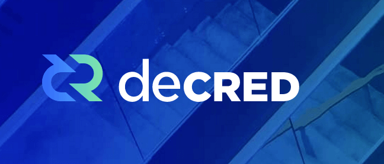

# Decred 生态应用

本章节主要介绍一些基于Decred项目以及Decred网络相关的区块链应用和技术详解。
1. [Dcrtime使用及原理](Dcrtime-application.md)
2. [Decred链上原子交换](atomic_swap.md)
3. [风靡世界的原子交换到底是什么](atomic_swap_example.md)
4. [Decred去中心化交易所 DEX](DEX.md)
5. [Decred闪电网络的革命](lightening_network.md)
