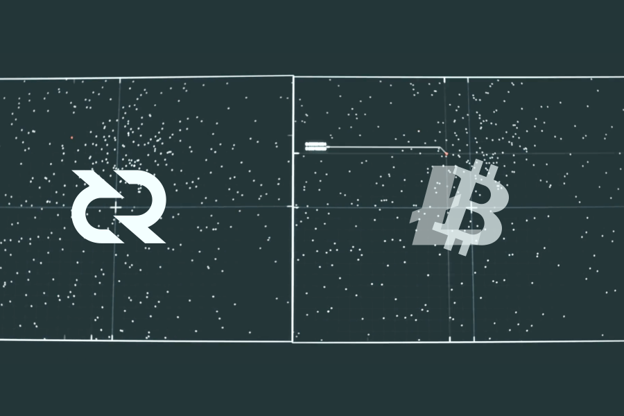

# 风靡世界的原子交换到底是什么

2017 年 9 月 20 号，Decred(DCR) 完成了与莱特币(LTC) 之间的第一次链上原子交换。DCR创始人Jake Yocom说：“其实之前原子交换发生过，但是通过黑客攻击的形式实现的。”**Decred团队开发了一款软件，最先与莱特币发起了一笔原子互换交易。**现在的新版本可以实现至少1300种货币之间的原子互换，包括以太网络的ERC20代币也可以实现。

### 信任的问题 

交易与生俱来伴随着信任问题，假设Alice想从Bob那里买比特币。而且Alice和Bob居住的地方相距很远，他们都无法信任对方。那么这次交易可能出现以下破坏交易的情况：

1. Alice收到了比特币，他可能不会将发给Bob；
2. Bob先收到了钱，他可能不会把比特币发送给Alice；

这笔交易的两个部分应该同时发生，但是实际情况是不可能的。

所以出现了以下解决办法：

1. Alice和Bob当面交易；
2. Alice和Bob找到一个他们都可以信任的第三方来帮助完成交易；

如果Alice和Bob当面交易，对于居住地很远的两人来说可能很不经济。对于第二种方法，选择一个可信的第三方需要很多花成本。一旦无法妥善地选择一个可靠的第三方，可能Alice或者Bob会遭受损失，甚至有可能两人都会损失。

### 原子交换如何工作 

拥有α coin的Alice和拥有β coin的Bob谈妥了交易，他们决定互换手里的币。按照以下步骤来交易：

1. Alice生成在α区块链上发送一笔“被锁起来”的交易，必须有“钥匙”和Bob 的签名才可以解锁；
2. Bob按照Alice 的交易（因为区块链是公开可见的，所以Bob会看到Alice发送的这笔交易）也创建了一个类似的锁具，需要相同的钥匙和Alice的签名；
3. Alice在有效时间内解锁了Bob的“密码箱”，得到了β coin，同时她的钥匙会在β区块链上显现出来；
4. Bob也在有效时间内用钥匙和自己的签名解锁了Alice 的“密码箱”，获得了α coin。
5. 如果他们都不能在有效时间内解锁，则会自动退回各自的coin。

原子交换通过把交易的两个部分都互相依赖，完成了交易的“去信任化”。原子交换不仅仅可以用于跨链的区块链资产交易。把支付宝等支付机构看成中心化的账本，Bob可以用自己的支付宝账户里的钱购买Alice的α coin，完成去中心化资产与中心化资产的价值互换。

### 意义 

Jake Yocom在采访中说到：“我们更伟大的目标在于实现跨链交易的完全去中心化，不需要交易所的参与，不需要与他人协调。这样可以避免很多中心化交易所面临的被盗、丢币等问题。当然，这会损害很多中间商的利益。试想一下，如果所有的金融产品都可以进行原子互换，这样纽交所、芝加哥商品交易所等机构就失去了存在的意义。”

**原子交换的伟大意义在于真正实现了去中心化，抛弃了交易所等第三机构来进行资产交易。**

翻译： DCR无双社区