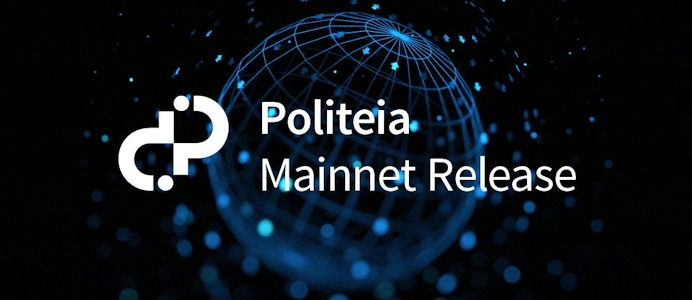

# 关于Decred去中心化组织（DAE）的未来设想

DCR的初始目标是想成为更好的比特币，实质是想建立一个去中心化可信的体系，这个体系流通的载体是DCR。我们可以拿这个体系来储值，支付，或者其他。DCR在实践的过程中，发现要去中心化可信，必要建立起来一个真正的DAO/DAE，否则没办法让人完全信服这个体系。**目前，我们是离去中心化自治组织这个目标最近的项目。现在正在进行投票的去中心化财务支付提案，是建立DAE非常关键的一步。如果去中心化财务支付真正实施后，我们可以说DCR开创了一个DAE雏形。**

我们在开创了一个DAE雏形后，我们离完整的DAO/DAE还有多远呢？

1. 我们需要提案投票通过后，有一个提案实施跟踪系统， 承包商每个月的实施情况都需要登记在这个系统里，帮助社区进一步了解提案的实施情况，社区对每个月的财务支付很大程度上要考虑这个系统里各个提案实施情况。
2. 我们需要去中心化财务支付更去中心化，每个月的支付报表由Pi系统自动生成。
3. 我们需要把社区基金的地址变成一个特殊地址，不能用钱包恢复和支付，而是只能在社区投票通过财务支付报表后，由链上的去中心化财务支付工具才能支付。我们可以把这种地址称为财政地址。
4. 我们需要让VSP更改不了选民POS选票的投票选项，这可以让Decred系统更加强大，更能抵御攻击。
5. 我们需要让Pi系统更去中心化更加开放，让Pi系统变成多节点化运营，每个节点可以互相通讯和互相监督， 让有能力的社区个人可以运行Pi系统或者接收Pi系统的各项数据，制衡Pi运营商的做恶的可能性。每年选出3-5个Pi系统运营商，由社区基金花钱支持他们运营Pi系统，让Pi系统多节点化。

如果Decred变成了一个真正的DAO/DAE, 下一步，**我们可以帮助其他一些有需要的组织，改造他们的组织架构，把他们变成一个DAO/DAE。**

目前哪些组织可能需要DAO/DAE呢？许多慈善机构，许多NGO组织，许多非盈利组织。 为什么他们需要DAO/DAE呢？他们没有盈利要求，对效率要求没那么高，他们需要的是做对的事情，而不是快速做事。**DAO/DAE, 可以让他们组织更公开、更透明、更公正，可以帮他们降低运营成本，可以帮他们扩大协作处理事务的范围。** 

我们怎么帮助有需要的组织变成DAO/DAE呢？

我们可以开发一套基于Decred系统的开源DAO组件，帮助有需要的组织变成DAO/DAE。 其他组织，他们想成为一个DAO/DAE, 他们没必要运行一条主链，这样做代价太高、成本太大，所以他们不需要POW矿工和POS选民，他们需要的是类似于Decred系统里贡献者的角色。他们需要的是一套实际可用的DAO Token运行体系，这个体系挂靠在其他强大的去中心化可信体系下面。

首先，我们要开发一套基于Decred OP_Return的DAO Token, 用来运营DAO。贡献者做出多少贡献，就获得多少DAO token。DAO token 的获取，通过给DAO做各种事务来获得。各个组织可以根据具体做的事类别，和做的事规模，完成的具体情况，来设计一个DAO token积分体系。后面情况有改变的话，可以通过全体贡献者表决系统来调整。

创建一类特殊的dcr地址-DAO财政地址, 用来保存支出这个DAO的所有财政资金。每新创建一套DAO Token时, 就会随机创建一个属于这个DAO 的财政地址。DAO的财政地址里的资金，只能通过DAO Token投票同意后，才能花出去。这类财政地址没有种子，不能通过钱包来恢复或者支付DCR。

开发一个DAO Token钱包，来保存DAO Token，并且可以在钱包里用DAO Token给这个DAO具体的各项事务投票。

这个DAO的人事管理系统CMS，基于dcr的贡献者管理系统修改，按这个DAO具体不同类别的贡献者来实际创建。新贡献者，有具体某个事务类别三个贡献者的同意，就可以加入。同意新贡献者加入的三个贡献者，他们都需要抵押一定数量的DAO token为新贡献者担保, 只有这个新贡献者通过做事获得一定量的DAO token, 才能解除担保抵押返给担保者, 并且给于一定量的DAO Token奖励。如果新加入的贡献者没达到一定量的DAO token之前，就捣乱或者被踢出，那需要扣除三个担保者抵押的DAO token做为惩罚。对贡献者的踢出，只要这个类别5个贡献者同意踢出，就可以踢出。如果被踢出者有异议，可以向CMS系统提出，让和这个被踢出贡献者所有相关事务的其他贡献者参与表决(限定50-100人吧)。

这个DAO的各项事务系统，基于dcr的Pi系统来具体创建。具体事务运行，由贡献者投票来决定，权重就是DAO Token。由贡献者提出具体事务的内容和需要花费的资金(贡献者的工资也包含在里面)和可以获得的DAO Token，根据事务的层次，由相关层次和类别的贡献者通过DAO Token表决。

每个月，由贡献者上传事务实施情况到事务系统中，由全体贡献者查看，并且可以投DAO Token赞同或者反对，只要不是反对率太高，都自动汇总到每月财务支付报表中，由全体贡献者通过DAO Token投票表决。财务报表通过后，由DAO财政地址自动支付dcr到相应地址。  

作者： Neil  
Decred微信公众号：Decred中文社区  
[Decred中文社区](https://blog.dcrclub.org) 