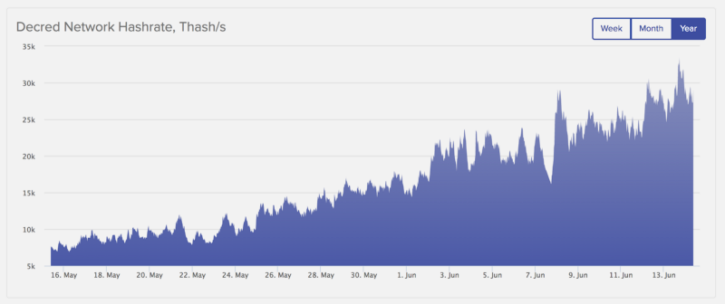
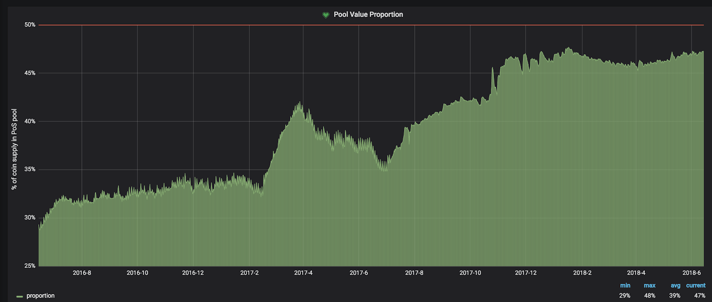

# 创投Blueyard的投资逻辑

原文来自 BlueYard Capital ，这是一家德国创投公司，致力于投资具有 “市场去中心化，授予用户权力及解放数据” 这一转型理念的项目。在投资了 Decred 后，于 2018 年 6 月 14 日发表了这篇介绍和解释他们投资 Decred 的文章。

### Decred

第一代（核心）区块链已证明了自己的极高价值和韧性（例如比特币，以太坊）。然而，尽管它们在机器和人类（智能）方面具有相当大的网络效应，但它们仍未实现可扩展的去中心化网络，也还没有技术能力能赋予应用层以强大的功能去实现优良，透明和可靠的治理系统，使自身生态系统的主要利益相关者广泛参与到重大决策和发展中。

虽然我们相信 “以中心化为始，之后去中心化” 这一政策有优势，但是在很多情况下，由于存在具有工作证明的超强矿工团，实际的掌控者，政治活动，内部纷争，缺乏内置的循环发展资金，以及利益相关者（即代币持有者）参与治理的可能性很小，大规模核心链仍然以中心化为主。

这些因素导致区块链发展缓慢，网络内的资源分配不均，区块链周围的社区分裂。随着区块链和加密货币走向“主流”且越来越有潜力成为世界市场和社会的新骨干，同时基于硬连接至（信息交换）协议的最佳管理模式，我们需要能提供更可靠更有效的衔接&发展平台的区块链和货币。

Decred（DCR）是基于以下核心特征的区块链和货币：

* **相互制衡：** 通过混合工作量证明和权益证明架构（例如比特币只是 PoW ）达成共识。具体而言，由 PoW 开采的区块然后由 PoS 矿工（通过治理票系统）验证（或拒绝）。
* **链上治理：** 协议升级（增量式升级以及全新功能）均由利益相关者 （Stakeholders) 进行投票。
* **开放参与/公共提案系统：** 利益相关者能够提出建议，决定获得资助的项目并能够参与项目层面的决策（Politeia）
* **自筹资金：** 部分区块奖励专用于发展基金（目前价值 5000 万美元） 矿工，利益相关 者和发展池所占区块奖励比例分别为 60%，30% 和 10%。请查看更多关于供应时间表的细节。（注1）

为了进一步深入探索，我们推荐了我们朋友在 Placeholder 上的摘要，Smith and Crown 的研究或 Epicentrepodcast。

还有一些其他突出特征，例如证明了 Decred 背后团队的精髓：没有向投资者出售 DCR，没有风险投资，也无需向交易所支付上市费用，强调了 Decred 团队和贡献者长期以来做事合理的理念（亦如该项目的规章里提到的）。

这并不意外，就像 Decred 创始人 Jake Yocom-Piatt 在2015年末发布的"Bitcoin’s biggest challenges"（注2) 这篇博文中表示 Decred 是人们对比特币沮丧的回应。自 2016 年 2 月推出以来，Decred 产生了重大的牵引力，带动成千上万的矿工和利益相关者，更重要的是，带动了一个非常活跃，规模巨大且不断增长的开发者 & 贡献者池，他们可以获得重要功能的内置循环资金。

### 哈希率发展

### 重大且不断增长的选票活动

流通中的 DCR 在票池中的比例，現在几乎是主网上线初期的 2 倍

这为新一代货币和存储价值链发展成丰富的1层区块链奠定了基础，从2018年的路线图中可以看出—其中包括闪电网络集成和智能合约能力，新的去中心化交易所，增强了隐私，DAO 并改进了可扩展性。Decred 不是一个单一体，而是可以随着时间不断扩展并与社区共同发展的项目。我们可以看到，最令人鼓舞的是，不仅是充满活力的社区使个体参与到项目中，大量有能力的开发者也蜂拥加入此项目。

### 论题

我们认为，区块链要实现他们的核心承诺，就需要成为一个更加透明和有效的平台。一流的管理加上永久资助，为用户和开发人员提供开放协作的环境，是可以使区块链取得突破发展的核心。如果 Decred 能够实现这一目标,它不仅可以成为主要加密货币之一，还会成为一个拥有蓬勃生态系统的更丰富的核心链。

与 Jake Yocom-Piatt，Jonathan Zeppettini 和其它社区合作后，我们在 5 月初开始建立一个重要的 DCR 仓位，并在几天前完成了初步建仓。我们这样做的初衷是成为 Decred 的长期积极支持者并积极参与网络治理。在活动初，我们很高兴地宣布，我们将于 7 月 18 日在柏林与一些核心 Decred 团队和贡献者举办见面会。我们会尽快公布更多细节，并希望能在那里见到你。

翻译：DCR 中文社区 （Wenjuan） 
原文：https://medium.com/@BlueYard/decred-82b284b4a795  
注1：https://docs.decred.org/advanced/inflation/  
注2：https://www.dcr66.com/threads/decred.9/

