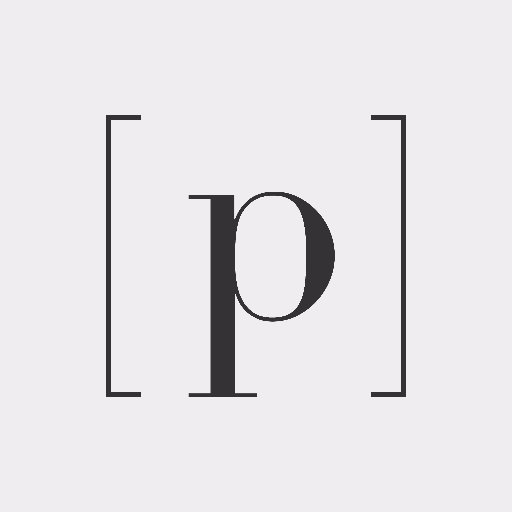
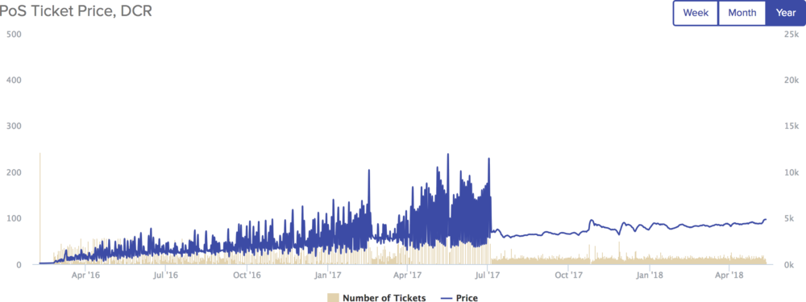
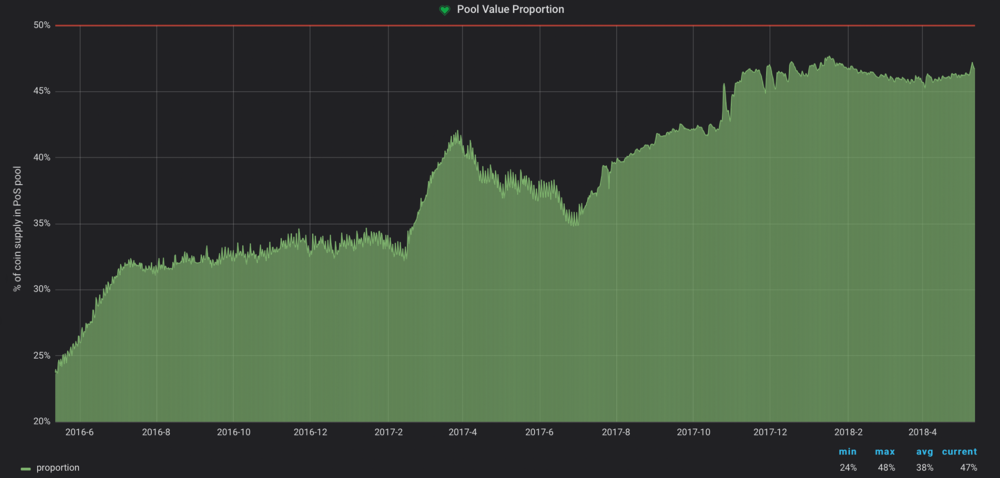
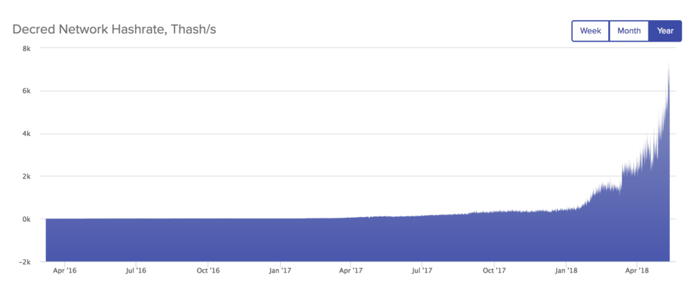

# 创投Placeholder的投资逻辑

**Decred 的獨到之處，在於擁有一個完善的達成決策共識的流程。擁有完善的決策流程，你便能擁有任何功能。 — Placeholder**

### 鏈上的共治

Decred  (DCR)  是一種使用了混合共識機制的加密貨幣，結合了工作證明 (proof-of-work)  與權益證明 (proof-of-stake)，來實現「鏈上的共治 (註1)」。其工作證明的挖礦機制，原理上與比特幣基本是一致的，其中不同之處在於：新區塊還需要獲得隨機抽選的 5 位持幣人 (註2) 的同意，才能成為有效區塊。而除了同意新區塊的有效性外，這 5 位持幣人同時能針對進行中的「共識代碼變更提案」進行投票，進而影響 Decred 的長期發展與進化。這樣的機制與架構設計，創造出的是一個透明公正的系統，能確保使用者、礦工、以及開發者之間的平衡與和諧。
* 註 1 — 這裡講的治理 (原文 Governance)，指的是一種「達成決策共識的流程」。例如比特幣社群在 SegWit 議題上爭論了超過 2 年，就是因為比特幣缺少一個恰當的共治模型，來達成最終的決策。而這便是 Decred 致力於解決的議題：如何在一個去中心化的網絡中，達成重大的決策共識。
* 註 2 — 任何持幣人都能參與這個抽選，但前提是要將一定數量的 DCR 「鎖」起來。這樣的機制讓持幣人以鎖起的 DCR 為擔保，來確保當他被抽到的時候，會做出益於 Decred 的最好決策。而被抽中的持幣人也會獲得部分的區塊獎勵。

### 選票的用途

若想參與抽選，用戶可以使用 Decred 的錢包，以 DCR 來購買「選票」。每個新區塊產生時，都會從「票池」中隨機抽選出 5 張選票，來決定這個新區塊的有效性。只要其中 3 張以上的選票同意，並將此新區塊加到主鏈上，此新區塊就是有效的；反之，則此新區塊就會被否決，並被捨棄 (這個情況下，礦工不會獲得任何區塊獎勵)。

除了驗證區塊的有效性，選票還有一個更重要的用途：表決 Decred 代碼上的異動。

* 持票人能針對代碼變更的提案進行表決
* 每個提案為期約為 30 天 (8,064 blocks)
* 結算需超過 75% 以上的同意票，提案才算通過並生效

票價的高低，其實就是 PoS 的難度，由權益難度演算法控制著。這個演算法透過調整票價高低，來維持票池中的選票數量在目標數量 40,960 張。簡單來講，越多人想購買選票來參與 Decred 的共治，票價就會越高。

### 投票獎勵

在被隨機抽選到並投票表決 (平均週期為 28 天) 後，選票就會被銷毀，同時該持票人會收到：

* 當初購買選票的 DCR
* 投票獎勵的額外 DCR (作為參與這個機制的回報)

若在有效期間 40,960 blocks 內 (約為 142 天) 都沒被抽選到，或因各種狀況而沒有順利投到票，選票便會過期並被銷毀，而該持票人還是會收到當初購買選票的 DCR，只是不會獲得投票獎勵。值得一提的是，選票過期的狀況確實會發生，但發生的機率小於 0.5%。

### Decred 項目的緣起

Decred 擁有當前最高水平的共治模型，而這一切的開始，是因為看到了比特幣生態中權力分布的失衡。主要的核心開發者及礦工擁有幾乎所有決策的決定權，而比特幣的使用者卻對決策沒有實質的話語權。

2013 年，Decred 的發起團隊 (原 Conformal Systems LLC，現名 Company 0) 以 Go 實作了一個 Bitcoin Core 版本：btcsuite 。儘管這具有高度的技術價值，比特幣核心開發社群非但沒有對此舉釋出善意，甚至將其拒之門外。

與此同時，在 Bitcointalk 論壇上，一位用戶名為 tacotime 的匿名用戶，開始了一個名為 memcoin2 的項目開發。這是最早提出混合共識機制的加密貨幣項目之一，旨在創建一個「透過參與式投票，讓貨幣資源的掌控以民主的形式交至用戶手中」的貨幣系統。

2014 年初，tacotime 和 _ingsoc (另一名 Bitcointalk 論壇的用戶) 向 Jake (Conformal Systems 創始人) 聯絡，討論 memcoin2 項目以及關於 “decentralized credits” 的想法。tacotime 在提出了這樣一個作為啟發 Decred 日後發展的種子後，隨後於 2014 年 4 月與一些人創建了 Monero 項目。而 Conformal Systems 在接受了這樣的啟發後，便將開發重心從 btcsuite 轉移至一個新的項目。
經歷約莫 2 年的開發時間，Jake 發表了一篇關於「比特幣的三大困境：治理、開發資金、礦工擁有過多權力」的探討，並暗示了一個解決了以上顧慮，一種全新的加密貨幣將被發表。

### 主網的上線

Decred 主網於 2016 年 2 月正式上線。這個項目沒有任何型式的代幣發售，或來自任何基金的資金挹注，只有 Company 0 自掏腰包了 $150 萬美元作為初始開發資金。上線初期，團隊先將 2100 萬的總貨幣供給數量中的 8% 創造出來，其中 4% 以免費空投的形式發放給了約莫 3000 位早期支持者，另外 4% 用以支付開發成本。

剩下 92% 的 DCR 供給，隨後至今正在被挖礦開採中，而每一區塊的區塊獎勵，以 60/30/10 的比例分配給礦工、投票人、及Decred 開發基金池。Decred 的開發基金池是一個很好的通膨資金範例：這個開發基金中有當前價值超過 $4,000 萬美元的 DCR，能支持 Decred 項目長期的發展，並且隨著項目發展越趨成熟，開發基金中的 DCR 也會隨著越有價值，進而能為項目的發展提供更長久的支持。選擇不將代幣預售給炒作者，隨著 Decred 的發展帶動的價格回報，便能最大程度的回饋在為這個項目貢獻的參與者身上。

### 現況分析

目前流通中的 DCR 有接近 50% 都在票池中，直接的展示了整體社群的投入程度，也間接地顯示了這個社群對於價格炒作與短線操作的行為是相對少的 (因購買選票需將 DCR 暫時鎖在選票中，且平均週期需 28 天，才能將購買選票的 DCR 解鎖)。

流通中的 DCR 在票池中的比例，現在幾乎是主網上線初期的 2 倍。

硬體方面，Decred 主網的算力正呈爆炸性的成長，僅僅 2018 年就成長了 19 倍，因針對 Blake256 雜湊演算法的各家 ASIC 礦機已成功開發，並陸續上線。

針對 Decred 開發的 ASIC 礦機，於 2018 年陸續出貨。這樣的算力成長模式，相似於 2013 年時比特幣網絡的算力成長模式。

而社群方面，Decred 公開透明的提案系統：Politeia，也即將於主網上線。Politeia 能讓參與者針對 Decred 發展的相關事務做提案，並交由社群共同決定是否使用開發資金池來支付該提案。提案內容可以是新功能的研究開發、應用程式的介面、組織社群聚會、交易所的整合…等，任何與 Decred 發展相關的行為，都可以作為提案提出。

儘管不知為何，Decerd 還尚未被太多人所認識，但這個加密貨幣項目的前景，是有十分充足的理由被看好的。在與 Decred 團隊每一次的接觸過程，都讓我們對這個社群的坦率氛圍與投入程度感到驚艷，甚至曾經讓 Jimmy Song 讚嘆「一群令人驚艷的開發者」。

### 未來發展

隨著開發團隊開始投入更多心力，試圖讓 Decred 更為人知，在 2018 開發藍圖中可以看到一些重點新功能的規劃，展示了這個項目的野心壯志。重點新功能包括隱私功能 (如同隱私貨幣的訴求)、將開發資金池真正的交至社群手中、閃電網絡的完整支持、一個去中心化的交易所、以及眾多既有功能與處理性能上的優化。要在短時間內看出所有功能要如何彙集或許為時過早，但我們非常興奮能參與到這個社群的發展，這是一個致力於完善「達成決策共識的過程」的社群，並且擁有一個非常投入的開發團隊。

Decred 的獨到之處，在於擁有一個完善的達成決策共識的流程。擁有完善的決策流程，你便能擁有任何功能。

译者： @morphymore

原文： https://medium.com/@morphymore/一篇-decred-的深度研究論文-翻譯-43bf1afc7127

