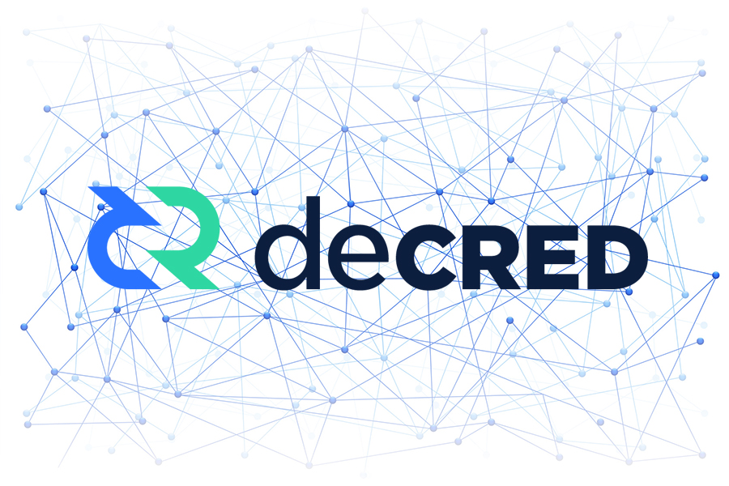

# Decred 精选文章

#### 去中心化治理

[Decred治理领域走得最远的项目](../chapter_04/dcr_best_governance.md) 
[Decred Politeia链下治理系统](../chapter_04/politeia.md)

#### PoS

[参与Decred PoS的五大理由](../chapter_02/why_join_pos.md)

#### 抗硬分叉

[从BTC分裂来看DCR抗硬分叉](../chapter_04/dcr_fork.md)

#### 闪电网络

[Decred闪电网络的革命](../chapter_05/lightening_network.md)

#### 去中心化交易所 DEX

[Decred去中心化交易所 DEX](../chapter_05/DEX.md)

#### 原子交换

[Decred链上原子交换](../chapter_05/atomic_swap.md)

#### 抗双花攻击

[Decred 攻击成本最高的项目](../chapter_07/double_spend.md)

#### 投资逻辑

[创投Blueyard的投资逻辑](../chapter_07/Blueyard.md) 
[创投Placeholder的投资逻辑](../chapter_07/Placeholder.md) 
[Decred的价值存储(SoV)](../chapter_07/SoV_of_DCR.md) 
[Decred完美满足持币者需求](../chapter_07/fullfill_holder_demand.md)

#### 创始人简介

[Decred创始人](../chapter_00/jake_intro.md)
