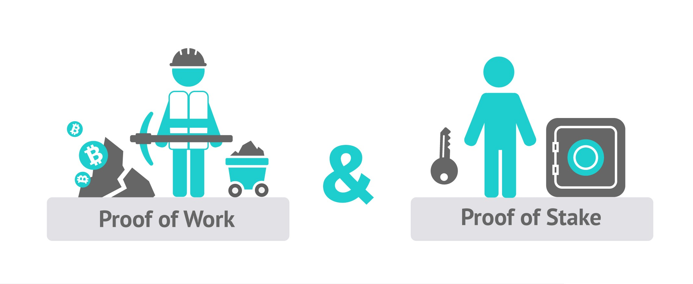

# DCR是如何解决BTC存在的问题

DCR 的创始人Jake Yocom从2013年就带领团队参与比特币生态系统的开发。大家可能都清楚BTC存在着治理问题，资金问题，和矿工权利过大的问题。DCR基于 BTC存在的几个问题做出了很多的重大改变。

### 共识机制改变

DCR团队在比特币社区的经历让他们知道也发现问题出在什么地方，DCR决定让每一名持币者都拥有发言权，不会让算力全都集中在PoW矿工的手里，在这里我给大家讲解一下关于BTC的PoW体制下存在的问题：

共识机制是区块链里最核心的内容。工作量证明机制（PoW） 是比特币采用的共识机制，可以把每一台矿机看作一个节点并等于一个投票权，所以导致了谁拥有更多的矿机，更多的算力，谁就有更多的表决权来决定最长链，就可以代表大部分人的意见。因此，实质上PoW机制下矿工在比特币社区中掌握最终决策权。就算你持有100万的比特币，也无法决定比特币的发展方向。长远来看PoW已经有中心化的趋势了！DCR在这之后融入了 PoS 机制，相当于多加了一个确认环节，PoS 矿工可以投票通过或否定之前 PoW 矿工产生的区块。如果 PoS 矿工否决了之前的区块，那么这些区块产生的奖励会减少或者归零，这就相当于 PoS 对 PoW 矿工起着监督作用。这样一来，PoW 矿工就会尽量避免社区反对的“存在疑问的行为”。

如果PoS矿工对区块进行了否定的话，那PoW矿工将无法拿到这个区块的奖励，换句话说只要PoS矿工达成协议，就可以一票否决之前PoW矿工打包的区块，PoS矿工可以提出他们判定区块合格与否的标准，但如果PoS矿工之间产生了分歧，那么此区块就将作废，但这是很少出现的情况，因为每一个PoS矿工也希望拿到奖励！PoW矿工更希望PoS矿工能为他们打包的区块进行投票，这将直接影响PoW矿工的收益，因为投票越多能得到的奖励越多。每个区块都会有5张选票，每一票代表20％的奖励，这将就可以极大地减少PoW矿工作恶的行为！

### 立宪法

DCR为了更好的治理项目想到了为DCR立一个宪法来保护这个项目，这样项目就可以在宪法的保护下自主的运行了，DCR的宪法内容包括了共识机制规则，如何解决分歧，治理模式，用户获得利益。宪法会表明这个项目的规则以及用户可以从项目中获得什么好处，也说明项目的规则。同比特币一样，新项目也设定了总量。以后还会有添加一些其他规则。通过遵守详细的规则，用户也会很清楚了解他们所在的这个社区的情况。

### 资金问题

BTC当时需要全职人员来维护项目和建设发展，但当时BTC的经济基本来自于社区和基金会的捐赠，但是显然这些资金是无法支撑BTC项目和Core团队的，所以最开始BTC钱包的开发工作基本是没有报酬的。这种情况显然是无法长久的。后来整个Core团队成员全都受雇于Blockstream公司，但这样相当于团队的方向都掌握在了Blockstream手上，因为Blockstream注重开发侧链来获得收益，但这是不符合BTC的持有者和社区的想法，而且用户根本无法分辨Core团队的做法是否受到了Blockstream公司的控制。

许多开源项目的治理问题都和缺乏资金有关，资金是所有开源项目非常重要的一环，如果单纯的依靠组织和社区的收入难以维持后续的研究与开发！ DCR为了解决这个资金的问题想到一个好的办法。就是每个区块的10％收益都会集中起来交给开发组织！开发组织会将资金统一用到开发及其他工作上，同时会对新加入的开发者支付相应的报酬。并且开发组织每年会做两次的财务公开和收集社区的意见。DCR这样的做法其实就是想让更多的人加入到DCR的开发中来，让DCR成为真正的由用户决定的去中心化产品。

### 总结

以上一系列的治理改变，我觉得将会很大程度上改变比特币的现状，但因为这些改变意义重大，而且涉及共识改变，因此无法在比特币上实现，所以DCR真的值得期待！

作者: DCR无双社区