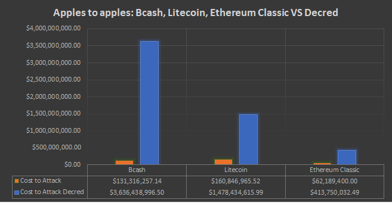

# Decred攻击成本最高的项目

Decred采用PoW+PoS混合共识机制，这种混合共识机制的好处我在之前的文章中也多次提到过，今天我们来讲一讲，通过攻击Decred需要付出多大的成本代价。

### 一种新型的混合机制PoW+PoS 

在Decred中权益证明者（PoS矿工）有权利去检查矿工（PoW矿工）挖出的区块，为了激励整个系统的运行。Decred系统做出的奖励分配为PoW得到60％区块奖励，PoS得到30％奖励，剩下的10％留给基金会用于项目开发和发展。

所有的持币者都可以在系统中购买选票来进行投票（PoS挖矿）。每个区块将会由五张选票来判定，选票会在整个系统的票池里随机选取，选票本身就是一个由协议控制的内部市场，每张选票的价格会在144个区块时间调整一次，大约12个小时，一个区块被确认所需的最低票数是三票，选票总共会在票池里锁定最多142天，在这个时间段选票被选中的概率高达99.5％。

### 单独PoW或PoS会被怎么样攻击 

#### PoW算力攻击

PoW共识机制的特点就是算力皆一切。在PoW的世界里只有算力才有发言权，因为PoW的共识机制中只会相信最长的一条链认为是主链，所以如果你能掌握51％的算力，你就可以对整个系统发起攻击，**这也就是51攻击**。

#### PoS算力攻击

**私钥攻击**，最开始的PoS版本中，总是使用一个固定化的验证者集，这样最大的缺点就是，已经出售了代币的用户还是可以参与到未来区块的验证中来，这可以说在早期是个巨大的漏洞，毕竟只要可以得到几个以前交易过的私钥就可以赚到大笔奖金。后来的PoS为了解决这个问题用了动态的验者集，可以随时对失去权益的账户进行权益消除，不过还是有两种情况下无法得到正确的验证：

1. 刚加入网络的新节点
2. 长期不活跃的节点

这两种情况一种是没有任何区块历史，或者长期丢失大量的区块信息。都无法准确的验证是否还有“权益”存在。

### 攻击Decred要比上述复杂得多 

为了解释这一点，让我们以Decred当前的PoS参与情况来举例，JAKE曾经在论坛上发表过一个简短的解释：

可能上述的分析比较复杂，简化上面的操作，攻击者需要一小部分票(F_S)。(6(1-f_s)⁵-15(1-f_s)⁴)/(6f_s⁵-15F_s⁴+10f_s⁴)乘以全网算力。如果我们根据攻击者可能持有的赌注百分比绘制上述公式，我们就可以确定攻击者需要多少算力才能比诚实的网络更快地创建区块。

这张图可以看出，所**以如果要攻击Decred网络攻击者需要至少50％的算力和50％的选票才可以发起攻击**，让我们来算一算满足这样条件需要花费的成本。 

 ### 攻击Decred的成本 

在7月份的时候有人统计过，如果用D9来举例，达到全网算力的50％大约需要4000万美金，再算上当时的代币价格，50％的选票大约需要1.3亿美金左右，总体算来大约需要1.73亿美元。以下是几个主流货币的理论攻击成本：

在上面的计算中，我使用了按照当前市场价格计算的挖矿设备，通过数据表明，**攻击Decred的成本将是比特币的22倍以太坊的9倍，以太现金，莱特币，以太经典，也都至少在8倍以上** 。

**由此可见Decred的混合共识协议通过创建一个代价很大的阈值来阻止大多数攻击。**

### 总结 

本文比较了攻击Decred比攻击当前的主流PoW币是如何付出更大的代价的。因为除了付出算力代价还要付出权益代价，Decred的混合协议确实也表现出了更好的安全性。

作者：Decred无双社区 、Zubair
 
 
