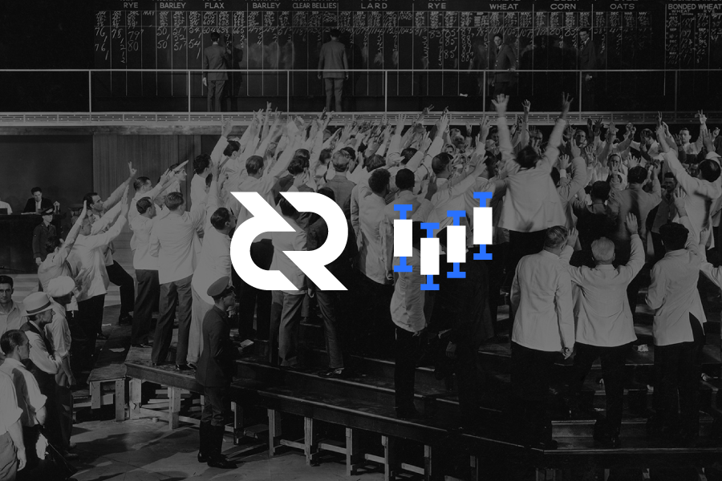
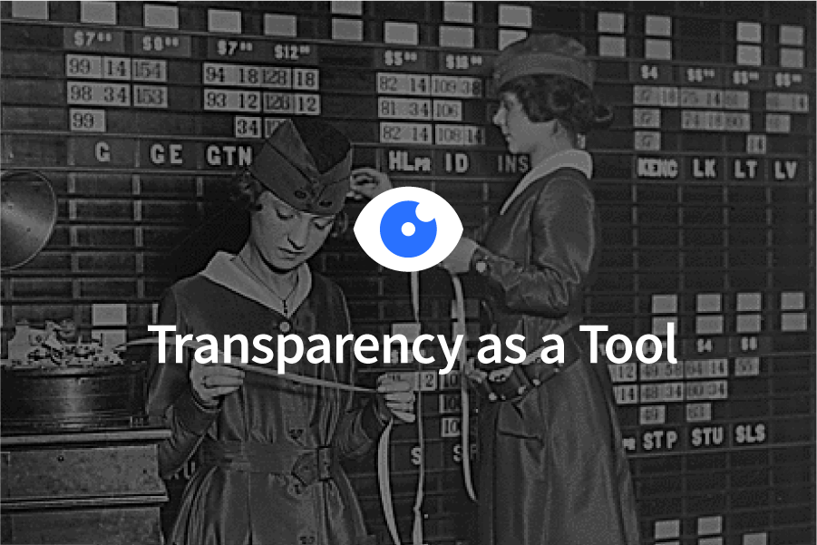
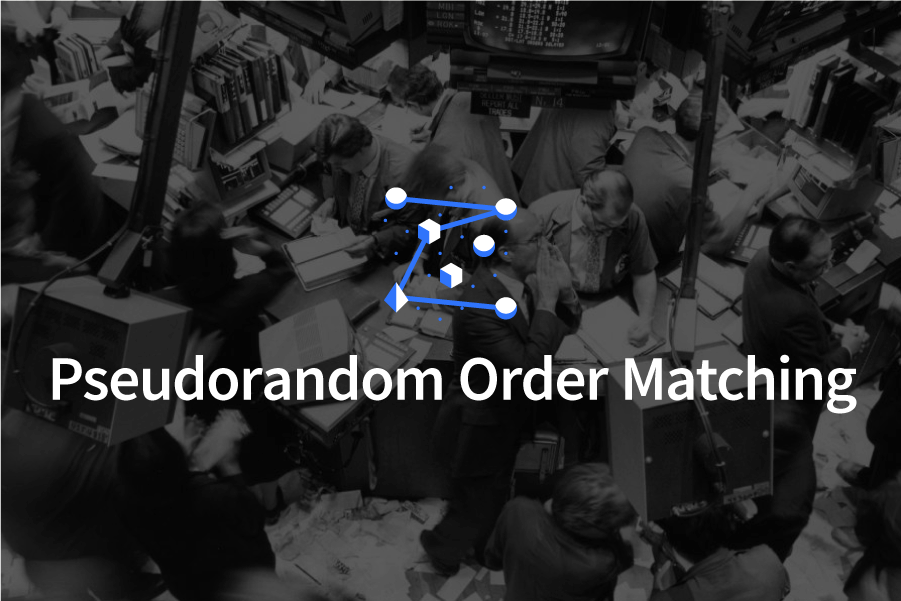

# Decred 去中心化交易所 DEX

在交易所被攻击，被骗，或是受到管制的情况下，去中心化交易所（DEX）是一种在数字领域持续被关注的一个概念。有一些数字货币项目的存在，使用一些代币或公链，目的是取代传统的中心化的“只是虚拟”的数字货币交易所。我们提出了现有的去中心化的去中心化交易所，具有以下特征：
* 它只帮助数字货币交易，不是法定货币。
* 它被设计成一个简单的客户端和服务器，不需要一个相应的 Token 或是公链。
* 服务器运营者从不监督客户的资金。
* 它使用线上交易完成订单和规则制定。
* 服务器的运营者匹配交易不收费。
* 增加对某个币种的支持直接关系到增加相应的原子跨链的支持。
* 交易所的订单可以被客户端和服务器的规则内部管制。
* 不良的客户端受到基于Politeia（提案系统）的声誉系统管制。
* 在服务器建立一个账户需要一笔直观的费用，打消不良行为。
* 订单的配对通过一段时间的伪随机产生。
* 买卖方的订单尺寸具有统一的大小。
* 限价单和取消单被客户端通过服务器广播，但是市价单是客户对客户的。
* 小单的近快速交易可以通过使用原子跨链的链下闪电网络完成。
* 服务器间使用网格网络来完成跨服务器交易匹配。
* 外部服务，例如钱包，可以通过连接一个简单的服务器的客户端API，其中包含数据反馈，能否下订单，和其他的服务。

我相信这个架构有能力去整体提高数字货币生态圈的适应性。接下来，我会从不同的角度，解释如何实施以上的这个架构。

###动机

每一个熟悉交易所的运营过程的人，熟悉使用一个交易所的人，或是熟悉在交易所上币的人都知道其中有很多门槛。对于中心化交易所的运营者们，有很多数不清的困难去克服，因为监督客户的资产需要伴随着各种特殊是司法上的管制和管制机构，例如，登记金融犯罪执法网络， 银行保密法， 遵守反洗钱条例，和注册成为一个资金划拨中介。对于中心化交易所的用户，遵守反洗钱条例实质上是一种对个人隐私的侵犯，并且交易所的客户端账户是可以被任何时间冻结的，由于各种原因。（区块链）项目想要在交易所上币经常要被迫付出很大一笔上币费，尽管这其中的过程是直接的。而且很多更大一些的交易所只对增加它们的交易收益有利的数字货币感兴趣。

一些 DEX 的项目是被创建用来解决这些问题，使用公链或是代币，并且他们达成了一些角度上的成功。但是他们取消了第三方信任（TTP），他们加入了他们自己的产品用来抵消交易费，这样等于说是用新的平台的问题代替了第三方信任的问题。这个简单的收集交易费的方式成为了中心化现有解决方案的催化剂，这个做法和开设志愿性的交易所不符。与此同时，为了去除第三方平台服务的公链或是代币，也产生了一些订单匹配上的挑战，这在中间性质的公链或是代币经常发生。

除了管制上的挑战以外，用户体验和技术上的角度，交易所和已有的DEX（去中心化交易所），以及他们的生态系统，容易受到高频交易算法（HFTs）的剥削。自1990 年，高频交易算法已经在财产，商品，和外汇市场上具有重要影响，并且已经发生过很多著名的“闪崩”的现象都是来源于高频交易者们同时卖出流动性商品。高频交易员们一般会保持一段时间持仓最少，但是他们持仓和空仓的频率非常高。他们利用先进先出（FIFO）在交易所的规则和低于其他竞争对手的计量延迟，例如，有的交易在离交易所非常近的服务器完成，使用大额交易达到最短数据延迟，使用 FPGA 或 AISC 作为下单的门电路，使用微波或是激光中继减少内部延迟。尽管这些尝试对于高频交易是正面的，例如，他们增加了市场的流动性，这些流动性可以在眨眼间消失，并扮演一个水泵或是虹吸的资金，从一个不复杂的市场参与者到一个高频交易人员来说。以上这些问题关于操作高频交易是否公平，这很明显，高频交易的操作者可以严重的扭曲交易商品的价格，扰乱价格发现的过程。很多高频交易员受雇于或是受资助于主流业的银行界投资，意味着尽管数字货币取消对银行的存储和发送资产的功能的使用，法定货币银行依旧可以间接地通过高频交易影响数字货币市场。

###实际上的考虑

为了使去中心化交易所 ( DEX ) 工作，有很多基础上的实际的事情必须考虑进去，使用原子跨链用来实现无需信任的数字货币的线上和线下交易是可行的。为了生成和保持订单列，需要一个用户可以交流价格的见面的地方。为了防止用户提交欺骗性的订单，需要一个机制去显示他们的订单的拥有者。用户需要有能力去发送和接受限价单和市价单，这样它们的订单能够被匹配。由于链上交易的限制，限价单必须有线上资产标准大小。这个用简单的客户端服务器的架构是可能实现的，然后把它们拓展到几个服务器之间互相传递订单，形成网格网络。

###原子跨链

像我们在 2017 年阐释的原子跨链工具，使用特殊的最小化复杂性的智能合约，两个不同的数字货币不依靠信任的方式去交换，是可行的，这个过程被称作原子交换。由于原子交换的不依靠信任的特性，这个是对创建去 DEX 的自然偏好。其它的 DEX 利用原子交换也是这个原因。原子交换可以处理链上和链下的交易对匹配，所以创建 DEX 变成了处理订单匹配的过程。

###“用户端-服务器” 架构

使用原子跨链作为基础的建造单元，我们可以讨论宽广的 DEX 的大致架构。几个现有的 DEX 的项目已经确定了利用单独的公链或以太坊的 Token 代替交易所。每种情况下，这些项目使用交易费作为收取交易过程的方式。无论如何，观察中的读者还记得原子跨链无需任何第三方单位。我们认为，不同于新建一个第三方单位作为公链或是 Token，最合理的方式是把 DEX 作为简单的客户端与服务器的服务，这样完全减少任何第三方。公链和 Token 是很 “沉重” 的解决方案并且施加了一系列的工程约束，所以解放我们，避开这些约束。在其最基本的方式，一个去中心化的交易所是一个简单的用户间想换币和参与价格讨论过程的见面场所。对去中心化交易所使用 “用户端-服务器” 模型帮助我们重新建立一个“无需允许与否”的交换形式：一个 “需要就喊价” 的角落。

###订单验证

防止客户创造虚假订单是确保 DEX 正常运行的一个重要组成部分。对于链上交易，显示对资金的控制，通过使用与订单中相应的资金私钥签署订单消息是直接的。一定要记得，在订单上使用私钥签名产生公钥，这个有一些不安全的隐患，特别是在量子计算机的进攻条件下。服务器需要检查每一笔订单是否是一个本地的公链的拷贝或是一个区块链浏览器的服务内容，去验证它是否有效和合理签名。一旦客户端的订单被服务器验证，它就能被服务器传播到一个或多个客户端。

###限价单和市价单的路由

一个 DEX 支持两种订单：限价单和市价单。限价单是挂出买卖价格单在一个特定的价格，而市价单是现货买家和卖家在最佳价格完成。服务器可以作为一个简单重复发送客户端订单的中继站，也可以收集和维护订单表，所以当客户端发送订单，它只是给订单表推送更新。每种情况下，限价单将会广播到其他客户端，这样市价单将会被直接路由到匹配市价单的客户端。为了防止服务器收到假的订单表，服务器会只传播有签名的订单到客户端，这样它们就能互相验证对方，订单表的订单有效。

###标准批量尺寸

一个重要的考量细节是链上的 DEX 如何处理部分交易的的订单，例如，有一笔限价买单是使用 100BTC 买入 DCR，另一个市场匹配卖单是使用DCR 买入 0.1 个 BTC 。如果我们允许任意大小的限制和市场订单，这造成了问题，因为达成部分交易的客户必须建立一个链上的交易，更新它们签字的订单，这需要等上几分钟甚至很长。更明显的是，假定我们有一笔限价单买入100个 BTC ，与之相对的卖出0.1BTC 的部分成交， 现价买单的客户端需要从原有订单做出改变，为了达成原子跨链的部分成交，99.9个 BTC 的订单需要变成新的订单，并提交到 DEX 上。为了防止这个问题，DEX 必须为买卖双方的交易对设定一个标准化的批量尺寸，客户端要根据批量尺寸下单。

###服务器网格

最小的 DEX 的可实现的产品是一个简单的 “服务器-客户端” 的架构，但是这个模型有很多缺点，当建立一个互相传递订单的服务器网格。在服务器到服务器之间增加（技术）支持是显然重要的，它允许世界范围内的生成订单，也使得在大范围内的网络掉线或短线的情况下更加稳定，而不像很多公链。

###一致化的激励

数字货币已经显示出，适当的一致化激励可以产生巨大的价值，并且我们的目标是在 DEX 的内容下重新一致化激励。对于数字货币，一致化激励与区块补贴和如何分配它们有关，并且在 DEX 下，如何处理交易费，担保费，和账户费是一个问题。在过去的 DEX 领域的竞争者中，我们已经看到了大量其他 DEX 项目如何分配补贴的问题，而不是重新凭空创造。

###零手续费

已知的全部 DEX 项目从每笔交易中通过其相应的公链或代币收取交易费，但是我们认为这是一个错误的奖励结构。在交易中收取交易费直接导致了交易服务的提供者的中心化，不管这是否是一个公链，代币或是服务。为了使用一个真正的去中心化交易所重新一致化激励，我们需要从 DEX 中取消交易费。很多未来的用户听到这个消息很开心，但是许多DEX 的项目或是中心化的交易所不愿意看到这个建议。有的人会问“如果没有交易费了，那么运营 DEX 服务器的奖励是什么？"，这个答案和"如果没有人付给你运营一个邮箱，聊天工具，或区块链服务器，为什么会有动机去运营？"相似。运营 DEX 服务器提供给你和别人一个可以使用的便利，这个是在区块链中的低成本的可替代价值。幸好不是所有人都需要为了实施这个架构运营 DEX 服务器，提供实质上的工具。

###无需监督的服务器

尽管原子跨链技术不需要服务器监督资金，服务器不监督资金也是另一个激励一致化的例子。当交易所监督资金，它的激励发生了改变。它的动机是不要从一个声誉和法律的角度上失去这些资金，但是它也有动机去做一些（不希望看到的）举动，例如，从用户手中收集大量个人信息，追查资金来源，向执法部门提供信息，延迟或限制取出和存入。除了这些失去资产的动机，总有一些诱因，使交易所成为坏的扮演者，例如，偷取用户资产，控制订单，在自己的订单上操控机器人，为一部分用户提供免费账户，为一部分用户提供交易延迟上的优势。DEX 服务器不监督资金，从规则上避免了大多数可能出现的不想要看到的诱因。

###客户端开户费

为了防止不良的客户端造成 DEX 服务器的故障，我们会对每一个新的客户端账户收一笔小的服务器设置费用。对于友好的客户端，这笔费用是必付的一次性的费用，用来获取服务器的服务，但是对于不良的客户端，这笔费用是要反复交付的，如果它们会造成故障，否则账户无法使用。这些费用不会随着交易量加大而加大，而是被用作为防止诈骗的阻碍器，间接性地弥补一些维护 DEX 服务器的费用。

###透明性作为一个工具

至今，大多数区块链的参与者已经把区块链的透明性视作一个重要缺点，但是我们会用透明性作为建造 DEX 的一个工具。通过完成链上的交换和密码验证，客户端和服务器都能掌握大量的不良行为。密码学的不良客户端或服务器的行为会被提交到提案系统的文件夹，在 DEX 产生一个独立的可验证的声誉系统。更明显的是，为一个或多个服务器建立一个类似的规则，使服务器和客户端掌管和执行一个可接受的条例，这是一种程度上的去中心化的规则。另一个使用链上的透明性的有益的副作用是使刷单这种虚假交易量变得更困难，参与可疑交易的举动能够被发现。

###基于提案系统的声誉系统

声誉系统将会基于 Politeia (提案系统）， Decred 的基于 git 的时序文件系统，它会使一个特定的客户端或服务器的特定时间的不良做法变得清楚。根据使用场景，具有多个声誉系统，用户选择公开或隐私交易是有可能的。客户端和服务器将会使用这些声誉服务作为基础，选择接受或拒绝订单。

###去中心化的管制

尽管 DEX 不会是一个区块链，但是建立自愿被网络的客户端与服务器的规则是有可能的。根据先前对订单格式的讨论，有一些规则必须被遵守，为了使 DEX 正常工作，例如订单伴随签名信息，表明具有对未花掉的货币的掌控能力。因为 DEX 使用链上交易，在构成一个有效的服务器或客户端的定义上可以设下任意约束，例如，一份有效订单需要数字货币在24小时没有被动过。客户端和服务器在有效订单组成或其他造成订单匹配的问题上达成一致是重要的，于是这些额外的规则和区块链的共识一样，需要在一个特定的区块链内相同，为了不引起分叉。甚至非常简单的额外规则，例如，订单只有在数字货币没有被移到链上 24 小时或以上才能被认为是有效的，可以产生重要 DEX 的效果，例如，限制客户每天一次调整他们的数字货币。这些额外的自愿接受的规则形成一套去中心化的管制，允许 DEX 冻结客户端和服务器认为不接受的行为，例如，多次欺诈。

###可验证的交易量

现有交易所的一个重要问题是它的虚假交易量。建立一个交易所，向外显示假的数据或使用交易所操控的机器人刷单，是容易的。中心化交易服务没有办法显示它们发生的交易是 “真实” 和不是虚假或刷单的，因为订单发生在链下，不能被分布化的总账查看。通过链上的 DEX，交易量可以被外部验证，通过相对应的区块链和发生的原子跨链。更进一步，尝试刷单能被发现，并被过滤掉，通过链上的交易历史。如果客户端和服务器发现符合特征，可以增加规则，防止其各种类似形式刷单。

###降低入门的门槛

有很多运行一个交易所和成为交易所的客户的门槛，所以 DEX 将会简化这些门槛步骤而被建起。根据先前的评论，DEX 将会有一个简单的客户端-服务器的架构，这个不仅从一个实际上的部署变得说得通，而且从降低入门的门槛角度也说得通。特定的数字货币从 DEX 取得支持是一个添加原子跨链的简单的事情。这些可以被项目的开发者完成，而不是交易所的服务人员。每个服务器的数据反馈都会被其客户端得到，并且可能选择性地提供历史交易数据，并被存储到提案系统文件夹内。

###简单地建立“客户端-服务器”

为了使 DEX 去中心化，简单地建立服务器和并被服务器添加作为客户端是简单的。建立 DEX 的替代品是繁重的，例如，建立和维护一个区块链或是通过反洗钱条例的约束建立服务。尽管不太可能，但是在国界线内建立某一区块链的区块通道是可能的，在任何交易所内建立区块通道也是同样可能的。直接建立一个 “客户端-服务器” 的架构不仅使建立新的服务器和客户端变得容易，也同样增加了审查的阻力。

###通过原子跨链增加（技术）支持

在交易所增加一个新的数字货币的的支持一般是一个耐心，政策，付款，或是一些其它的事情的一些组合的事情。目前在交易所上币的过程是一个对项目资源真正的吸血，并在该项目上放置一些人为财务上的约束。在 DEX 上一个特定项目的唯一要求是它需要支持相应的原子跨链，这样减少了现存的政策和流程上的有关上币服务的阻力。简单地在交易所上币，将会帮助数字货币项目之间的同场互动。通过上币，一些项目能够相比其它项目取得一个实质性的优势。

###客户端的 API（应用接口）

客户端可以得到从客户端的数据反馈，并用作收集实时和历史性数据。API 会允许客户端得到订单书的记录，订阅订单书的更新，和取得历史的数据。因为数据从服务器端收集，实时和历史数据随着服务器间的不同而变化。可得到的数据质量和总量将会实质性增加，一旦服务器可以相互中继。支持 DEX 的钱包将会使用客户端的 API，为了用户界面的考虑。

###延迟性的游戏

因为数字货币市场在规格和成熟度上的增长，它们已经变成了一个自动化交易算法的成熟目标，尤其是高频交易算法（HFT）。根据交易所的观察，HFT 实质性增加交易量，但是这个交易量的价值是最好画一个问号的。DEX 将使用在每一轮的伪随机订单匹配减少 HFT 的效果，尽管它仍然允许低频交易公平地得到他们匹配的订单。说一下链下的交付系统，例如闪电网络，它能被用作交易所，但是你要明白一个重要的事情，其中有很多透明性和价格发现的问题，这些问题和现有的财产或商品交易所相似。

###伪随机的订单匹配

现代金融市场被高频交易算法 (HFT) 占据是经常没被讨论的。减少 HFT的影响经常被很少讨论，因为交易所被利益驱使，通过 HFT 增加交易费的利益，允许 HFT 的行为。一些传统的交易所，例如，IEX和CHX，已经增加了 350 毫秒的“速度阻碍”减少低于这个阈值的套利，该做法向修复HFT 的问题迈出一些步骤。相较于只是部分解决延迟套利，利用 350毫秒的套利还是有可能的，DEX 会每轮随机匹配订单。使用10秒或是更长时间的一轮产生随机数，应该会实质性减少客户端利用连接服务器的低延迟的优势。通过减少先进先出（FIFO）的订单匹配算法，客户端能够匹配他们的订单，在一个每轮公平展示的方式。这样减少了大多数成功HFT 的“插队”的行为。

###分开的链下支系统

考虑到链下支付系统需要低延迟，例如闪电网络，检验它们在 DEX 的使用是自然的。一个链上运营 DEX 的主要优势是跨链可以被展示，和被验证不是刷单。像闪电网络实验室已经展示的那样，链下的原子跨链实是真实可能的，但是验证发生匹配和这些匹配不是刷单是重要的，并且可能是很困难的步骤。为了解决闪电网络的透明性和价格发现的问题，DEX 可以合并链下的跨链作为低延迟下的小额订单。除了链下的订单书，订单可以通过 DEX 的链上市场市场价格成交，这样透明性和价格发现可以随着更少的复杂性发生。

###蓝图

这个提案的大多数是关于一个理想的 DEX 应该如何运营和它应该如何使用现有数字货币框架实现的实质考虑。退一步讲，这里提出的是一个数字货币交易所的混合框架。和电话和网络开关混合的电磁通讯一样，数字货币和它们的交易所混合着存储，传输和价值交换一样。闪电网络的守护进程，lnd，实际上是一个无需允许，中立，无需监督，智能合约的混合器，和我们提出的 DEX 相似。当 DEX 会在链上和数字货币之间操作，Ind 在链下对特定数字货币操作。

已知的 DEX 项目的目的是做一个“胖”的原型，使用它作为赚钱的服务，而我们提出的，是为了做一个“瘦”的原型。通过使用瘦的原型，减少中心化的利益驱使，我们的目的是提供长线价值，通过增加数字货币市场的稳定性。把所有的数字货币放在一个更平等的交易所的立足点，这样会简化取得数字货币的过程，对整个生态系统将会有益。

###结论

通过最小的阻力，风险和中心化的能力，去交换数字货币，是从公共获得数字货币的重要步骤。像上述建立 DEX 将会：
* 使项目和用户无需允许地交易
* 减少门槛，入门障碍和大多数费用
* 比媒介公链或代币更抵抗审查
* 在价格发现的过程减少高频交易算法 (HFT) 的影响
* 从捕食者口中保护数字货币生态的资产
* 防止和过滤刷单，建立可验证的交易量
* 帮助去中心化的交易规则管制

本预提案基于 Decred 博客做出，因为它与 Decred 和更广阔的数字货币社区有关。一旦我们的提案平台，Politeia 在主网建立，提案将会被提交，伴随着寻找开发者和该项目的资金目标。我们估计 DEX 将会使用1-5百万美元，在 6-18个 月建立，取决于有兴趣的开发者。如果其它数字货币项目有兴趣与我们合作建立 DEX，我们完全开放，欢迎来我们的Slack并加入频道#thedex.

译者注：
Incentive Alignment 激励一致性是金融学的术语，见http://www.cbrc.gov.cn/chinese/files/2016/E682DC14425546E2A636F4605136ACB9.pdf

Decred 中国社区
翻译：画面
原文链接：https://blog.decred.org/2018/06/05/A-New-Kind-of-DEX/
译者 DCR 打赏地址：DsmZHhRnvLQaDQcSSRco7RA8AcDZH9SKWQw
